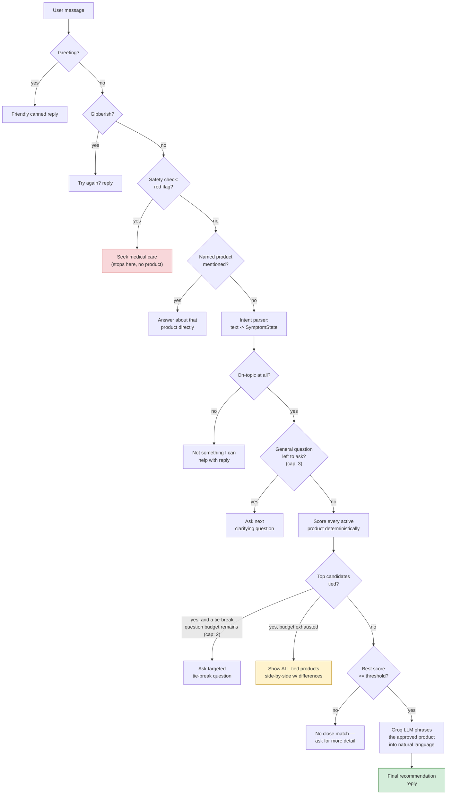
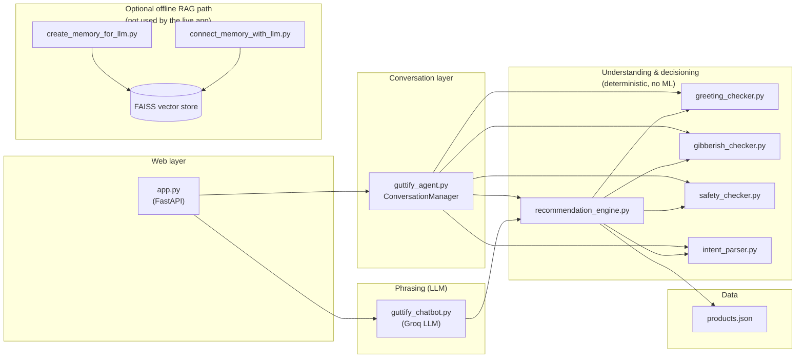

# Guttify AI Assistant — Project Report

## 1. What This Bot Is

Guttify AI Assistant is a conversational product-recommendation chatbot for **Guttify**, a
gut-health / wellness supplement brand. A user describes a symptom in plain language
("I feel bloated after eating dairy"), and the bot has a short, natural back-and-forth to
understand the symptom, then recommends the single Guttify product that actually matches
it — pulled from Guttify's own product catalog, never invented.

The core design decision behind the whole project is a **separation of "deciding" from
"talking"**:

- A deterministic, rule-based Python engine (no ML, no embeddings, no vector database)
  owns every decision that matters: which symptom the user has, which product matches,
  whether the situation needs a doctor instead of a supplement, and what to ask next.
- A small hosted LLM (via Groq) is used **only** to turn an already-decided answer into
  natural conversational text. It is never allowed to pick a product, invent an
  ingredient, or override the deterministic layer.

This means a product can never appear in a reply unless it was actually loaded from
`products.json`, and the bot can never quietly hallucinate a dosage, warning, or benefit
that isn't in the data.

## 2. How It Works — The Conversation Pipeline

Every user message is run through the same ordered pipeline before anything is sent back:

1. **Greeting check** — a bare "hi" / "hey" / "what's up" gets a friendly canned reply
   instead of being treated as gibberish or off-topic.
2. **Gibberish check** — keyboard-mash input ("asdkjhasd") is caught with cheap heuristics
   (vowel ratio, consonant runs, keyboard-row substrings) and gets a light "try again?"
   reply, skipping the LLM call entirely.
3. **Safety check** — text is scanned for red-flag medical language (e.g. vomiting blood,
   jaundice, fainting, difficulty breathing). If found, the flow stops immediately and the
   user is told to seek medical care — no product is ever recommended for this. A second,
   softer tier of caution rules (pregnancy, existing conditions, medication use) still lets
   the conversation continue but appends a "check with a doctor" note.
4. **Named-product lookup** — if the user is clearly asking about a specific product by
   name ("what are the ingredients in Piloease?"), that bypasses the whole symptom
   conversation and goes straight to answering about that product.
5. **Intent parsing** — free text is converted into a small structured record
   (`SymptomState`): primary symptom, secondary symptoms, frequency, whether it's food
   related, and which food triggers it. This uses a large hand-built synonym vocabulary
   (see §4) rather than an embedding model, so its output is always one of a fixed,
   trustworthy set of values.
6. **Relevance check** — if nothing symptom-related was found and the message doesn't even
   share vocabulary with the product domain, it's treated as off-topic.
7. **Clarifying questions (bounded)** — up to **3** general questions are asked
   (what's the main symptom → how often / food-related → which food triggers it), and a
   question is only asked if that piece of information isn't already known. The bot never
   re-asks something the user already said.
8. **Tie-breaking (bounded, separate budget)** — once enough is known to score products,
   if several products score within a close margin of each other, the bot asks up to
   **2 additional, targeted** questions aimed specifically at the symptom that
   distinguishes the tied products (e.g. "are you also noticing brain fog, constipation,
   or fatigue?"), rather than a generic "tell me more."
9. **Deterministic scoring** — every active product is scored against the structured
   state. A product scores zero unless its symptom list contains an exact match for the
   user's primary symptom; secondary symptoms, food-trigger matches, and light keyword
   overlap only add on top of that base match — they can never manufacture a match by
   themselves.
10. **Outcome**:
     - **Clear winner** → `RECOMMENDATION_FOUND`, and the top product is handed to the LLM
       to phrase.
     - **Still tied after the extra questions** → `AMBIGUOUS`, and the bot itself (not the
       LLM) builds a message laying out every tied product side by side with what's unique
       to each one, so the user can choose instead of the bot guessing.
     - **Nothing matches well enough** → `NO_MATCH`, asking for more detail.
11. **LLM phrasing** — only for `RECOMMENDATION_FOUND` / `PRODUCT_INFO_FOUND` does the Groq
    LLM get involved, and only to phrase an already-chosen, already-approved product
    dictionary into natural language, using a strict prompt that forbids inventing
    anything not present in the supplied data.

Session state (the running `SymptomState`, how many questions have been asked, how many
tie-break questions have been asked) is held per-session in server memory and resets when
the server restarts — there's no database in the live path.

## 3. Architecture

### 3.1 Request flow

### 3.2 Module / dependency map

## 4. File-by-File Breakdown

### Live application (what actually runs in production)

**`app.py`** — The FastAPI entry point. Thin HTTP layer only: creates sessions
(`POST /api/session`), handles chat turns (`POST /api/chat`), serves the static frontend,
and keeps per-session chat history + `ConversationManager` in a process-memory dict. Maps
each conversation `status` (e.g. `ASK`, `AMBIGUOUS`, `RECOMMENDATION_FOUND`) to either a
canned/deterministic message or a call into the LLM phraser. Explicitly documented as
single-process only — needs sticky sessions or shared storage (e.g. Redis) to scale to
multiple workers.

**`guttify_agent.py`** — The conversation orchestrator (`ConversationManager`). Holds one
`SessionState` per session (structured symptom state + question counters). On each
message it runs greeting → gibberish → safety → named-product checks, merges the message
into the running `SymptomState`, then decides what to do next: ask one of up to 3 general
clarifying questions (`QUESTION_TEMPLATES`), ask up to 2 targeted tie-breaking questions
(via `recommendation_engine.get_disambiguation_question`) when candidates are scored too
close together, or hand off to the recommendation engine for a final answer. It never
decides which product wins — that's `recommendation_engine.py`'s job — it only manages
*when* to ask vs. when to conclude.

**`intent_parser.py`** — Rule-based NLP layer. Defines the canonical vocabulary the whole
system trusts:

- `SYMPTOM_SYNONYMS` — canonical symptom name → a large list of everyday/colloquial
  phrasings (including common Indian-English terms like "gastric trouble", "paneer",
  "atta") that all map to it.
- `FOOD_TRIGGER_SYNONYMS`, `FREQUENCY_PATTERNS`, `FOOD_RELATED_PATTERNS`,
  `NAME_QUESTION_ASPECTS` — the same synonym-mapping approach for food triggers, how
  often something happens, whether it's food-related, and which aspect of a product
  (ingredients/usage/warnings/price) the user is asking about.
- All matching uses precompiled **word-boundary regex** (not raw substring checks), so
  short synonyms like "gas", "pain", or "itch" don't false-positive inside unrelated
  words (e.g. "itch" inside "kitchen").
- `SymptomState` — the structured record passed around the whole system.
- `merge_state()` — merges a new message into existing state, only overwriting a field
  when the new message actually supplies a value (so earlier answers are never lost or
  re-asked for).
- `validate_llm_extraction()` — a safety net so that if an LLM-based extractor is ever
  plugged in ahead of this rule-based one, its output is verified against the known
  vocabulary before being trusted; anything unrecognized is discarded in favor of the
  rule-based result.

**`safety_checker.py`** — Two-tier safety layer.

- **Red flags** (vomiting blood, black stool, jaundice, fainting, difficulty breathing,
  severe/worsening symptoms, etc.) — detecting any of these **short-circuits the entire
  flow**: no product is recommended, and the user is told to seek medical care.
- **Caution rules** (pregnancy/lactation, existing liver condition, diabetes/chronic
  illness, currently on medication, worsening/bleeding piles) — these don't block a
  recommendation but attach a "check with a doctor first" note to the response.

**`recommendation_engine.py`** — The deterministic decision core, and the largest file in
the project. Responsibilities:

- Loads `products.json` once at import time.
- `has_domain_overlap()` — a lightweight, auto-built vocabulary (from every product's
  category/symptoms/support text) used only to distinguish "on-topic but vague" from
  genuinely off-topic messages.
- `find_named_product()` — lets a user reference a product by name directly, using both
  exact-name matching and a set of auto-derived "distinctive tokens" per product name
  (tokens unique to one product and not overlapping ordinary symptom vocabulary).
- `score_product()` / `score_all_products()` — the actual scoring rule: **zero unless the
  primary symptom is an exact match** against that product's symptom list; secondary
  symptoms, food-trigger relevance, and category-keyword overlap only add small bonus
  points on top of a real primary match.
- **Tie handling** (`get_tied_candidates`, `get_differentiating_symptoms`,
  `get_disambiguation_question`, `build_ambiguous_message`) — when multiple products score
  within a close margin of each other, these find a symptom that's present on some tied
  products but not others (and hasn't been asked about yet) to propose as a targeted
  follow-up question; if the tie survives every available question, they build a message
  that lists every tied product with what's uniquely relevant to it and what it supports,
  instead of forcing an arbitrary pick.
- `evaluate()` — ties it together into one of three outcomes: `RECOMMENDATION_FOUND`,
  `AMBIGUOUS`, or `NO_MATCH`.
- `recommend_product()` — a single-shot convenience wrapper (used by the CLI / any caller
  that doesn't need multi-turn session state) that runs the full pipeline in one call.
- A `__main__` block that runs the whole engine as a standalone interactive CLI for
  testing without the web app or the LLM.

**`greeting_checker.py`** — Recognizes when an entire message is *just* a greeting ("hi",
"yo", "namaste", "good morning") using a strict regex so that "hi, I have bloating" still
flows into the normal conversation rather than being swallowed as a greeting.

**`gibberish_checker.py`** — A cheap, non-ML heuristic filter for keyboard-mash input:
checks vowel ratio, long consonant runs, and known keyboard-row substrings (`qwerty`,
`asdf`, etc.) to decide whether a message even looks like language, so the system can skip
an expensive LLM call and reply with something light instead.

**`guttify_chatbot.py`** — The only file that talks to the LLM (Groq, model
`openai/gpt-oss-20b` by default, chosen for its much higher free-tier daily request cap
vs. the 70B models). Contains the strict system prompt that forbids diagnosing, inventing
products/ingredients/dosages, or replacing the already-approved product with a different
one. `format_product_information()` turns an approved product dict into the exact text
block the LLM is allowed to draw from. Also contains a standalone `chatbot()` CLI loop for
testing the full experience from a terminal.

**`products.json`** — The single source of truth for all product data: name, category,
symptom list (the only symptoms scoring can ever match against), intended support,
ingredients, usage instructions, warnings, age group, product URL, and flavor/variant
options. Nothing about a product is ever invented at request time — if it's not in this
file, it can't be recommended or described.

### Optional / offline (not used by the live app)

**`create_memory_for_llm.py`** — A standalone script that loads PDFs from a `data/`
folder, splits them into chunks, embeds them with a HuggingFace sentence-transformer, and
saves a FAISS vector store to disk. Exists as an alternative RAG-based approach; the live
FastAPI app never imports this.

**`connect_memory_with_llm.py`** — A one-shot CLI that loads that FAISS store, lets the
user pick a symptom category from a menu, retrieves relevant chunks, and asks a
HuggingFace-hosted LLM to phrase a recommendation from the retrieved context. Also not
imported by the live app — kept as a separate, heavier-dependency proof of concept.

### Project plumbing

**`requirements.txt`** — Pinned/loose dependency list. Clearly separates what the live app
needs (`fastapi`, `uvicorn`, `langchain-core`, `langchain-groq`) from what only the
optional offline RAG scripts need (`langchain-community`, `langchain-huggingface`,
`sentence-transformers`, `faiss-cpu`, `pypdf`, etc.) — the live recommendation path itself
has no ML/embedding dependency at all.

**`Pipfile`** — Pipenv equivalent of the dependency manifest, pinned to Python 3.11.

**`Dockerfile`** — Builds a `python:3.11-slim` image, installs `requirements.txt`, copies
the project in, and runs `uvicorn app:app` on port 8080 — a straightforward
container-based deployment path.

**`.gitignore`** — Excludes `.env`, virtual environment folders (`env/`, `.venv/`),
`__pycache__/`, and compiled `.pyc` files from version control.

**`README.md`** — Project-facing documentation: setup/installation, environment
variables, running locally, API endpoint reference, example conversations, and testing
instructions.

## 5. Design Principles Worth Calling Out

- **The LLM never decides.** It only phrases an answer that a deterministic Python engine
  has already fully decided, using only data supplied to it in the prompt. This eliminates
  hallucinated products, ingredients, dosages, or claims by construction, not by hoping
  the model behaves.
- **Safety short-circuits everything.** Red-flag detection runs before any product logic
  and cannot be overridden by anything downstream.
- **No forced guesses.** Both the general Q&A flow and the newer tie-breaking flow are
  built around *not* picking a product when the evidence doesn't clearly support one —
  either by asking a better question or by showing the honest set of close contenders.
- **Vocabulary-robust, still fully auditable.** Understanding user phrasing is handled by
  an explicit, hand-maintained synonym dictionary rather than an embedding model — broader
  coverage can always be added by extending a list, and every match can be traced back to
  the exact phrase that triggered it.
